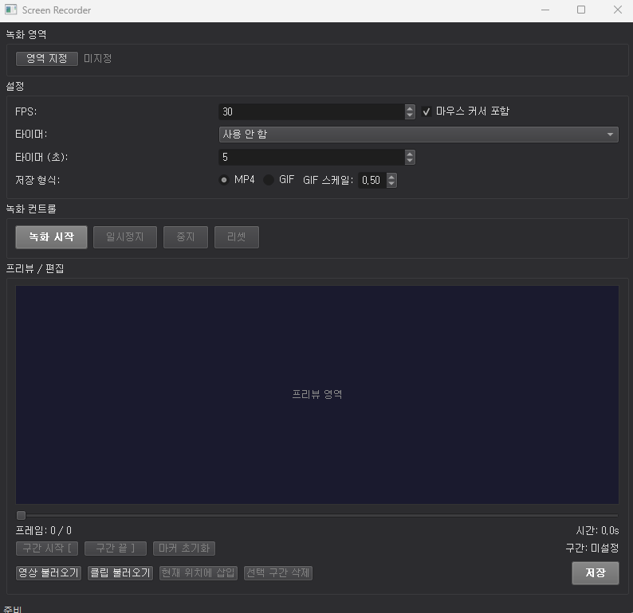

# Screen Recorder

Windows 환경에서 지정 영역을 녹화하고 편집할 수 있는 화면 녹화 프로그램.



## 주요 기능

- **영역 지정 녹화** — 마우스 드래그로 녹화할 화면 영역 선택
- **마우스 커서 포함/제외** — 체크박스로 커서 녹화 여부 설정
- **FPS 설정** — 1~60 프레임 조절
- **타이머** — 카운트다운 후 시작 / 녹화 시간 제한
- **디스크 버퍼 모드** — 장시간 녹화 시 RAM 대신 디스크에 프레임 저장
- **녹화 컨트롤** — 녹화 시작, 일시정지, 중지, 리셋
- **프리뷰** — 녹화 후 타임라인 슬라이더로 프레임 탐색
- **영상 불러오기** — 기존 비디오 파일을 타임라인에 로드
- **클립 삽입** — 외부 영상을 현재 타임라인 위치에 삽입
- **구간 삭제** — 시작/끝 마커 지정 후 해당 구간 제거
- **저장** — MP4 또는 GIF 형식으로 내보내기 (GIF 스케일 조절 가능)

## 사용 방법

### 실행

`dist/ScreenRecorder.exe` 실행. 별도 Python 설치 불필요.

### 녹화

1. **영역 지정** 버튼 클릭 → 화면에 반투명 오버레이 표시 → 마우스 드래그로 녹화 영역 선택
2. FPS, 타이머, 커서 포함 여부 등 설정 조정
3. 장시간 녹화 시 **디스크 버퍼** 체크박스 활성화 (아래 참고)
4. **녹화 시작** 클릭
5. 녹화 중 **일시정지** / **중지** 가능
6. 중지 시 프리뷰 영역에 녹화된 영상 표시

### 편집

- **타임라인 슬라이더** — 드래그하여 원하는 프레임으로 이동
- **구간 시작 [** / **구간 끝 ]** — 현재 위치를 구간 마커로 지정
- **선택 구간 삭제** — 지정 구간의 프레임 제거
- **클립 불러오기** → **현재 위치에 삽입** — 외부 영상을 타임라인 중간에 삽입
- **영상 불러오기** — 기존 비디오 파일을 메인 타임라인으로 로드

### 저장

1. 저장 형식 선택 (MP4 / GIF)
2. GIF 선택 시 스케일 비율 조절 가능 (0.1~1.0)
3. **저장** 버튼 클릭 → 저장 경로 선택 → 내보내기 진행

## 직접 빌드

Windows 환경에서 직접 빌드할 경우:

```
python -m venv venv
venv\Scripts\activate
pip install -r requirements.txt
pyinstaller screen_recorder.spec --clean
```

결과물: `dist/ScreenRecorder.exe`

또는 `build_exe.bat` 더블클릭으로 자동 빌드.

## 프로젝트 구조

```
screen_recorder/
├── main.py                  # 진입점
├── requirements.txt         # 의존성 목록
├── screen_recorder.spec     # PyInstaller 빌드 설정
├── build_exe.bat            # Windows 빌드 스크립트
├── gui/
│   ├── main_window.py       # 메인 윈도우
│   ├── region_selector.py   # 영역 선택 오버레이
│   └── video_preview.py     # 프리뷰 및 타임라인
├── core/
│   ├── recorder.py          # 화면 캡처 엔진
│   ├── editor.py            # 프레임 편집 (삽입/삭제)
│   ├── exporter.py          # MP4/GIF 내보내기
│   └── disk_buffer.py       # 디스크 기반 프레임 저장소
├── utils/
│   └── cursor.py            # 마우스 커서 캡처
└── dist/
    └── ScreenRecorder.exe   # 빌드된 실행 파일
```

## 요구 사항

- **실행:** Windows 10/11 (64-bit)
- **빌드:** Python 3.10+, 패키지는 `requirements.txt` 참조

## 저장 모드

| 모드 | RAM 사용 | 디스크 사용 | 특징 |
|------|---------|-----------|------|
| **메모리 (기본)** | 프레임당 ~6MB (1080p) | 없음 | 빠름, 단시간 녹화에 적합 |
| **디스크 버퍼** | 경로 문자열만 (수 MB) | JPEG 프레임당 ~50-200KB | 장시간 녹화 가능, 약간 느림 |

- "디스크 버퍼 (장시간 녹화)" 체크 시 프레임을 임시 폴더에 JPEG로 저장
- JPEG 품질 조절 가능 (50-100, 기본 95)
- 프로그램 종료 시 임시 파일 자동 정리

## 참고

- 음성/오디오 미지원 (영상 전용)
